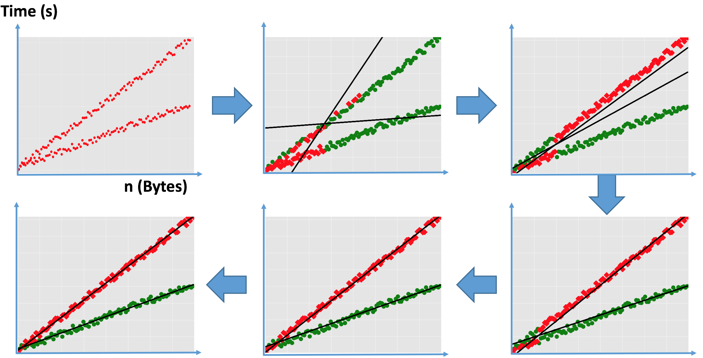

# DPDEBUGGER
The repository for the implementations of performance debugging with machine learning tools
Paper can be found here: [Differential Performance Debugging With Discriminant Regression Trees](https://www.aaai.org/ocs/index.php/AAAI/AAAI18/paper/view/16647), AAAI'18, 2468-2475.


The goal of Differential Performance Debugging is to explain unexpected performance differences of a program tested on different inputs.

DPDEBUGGER is a two steps approach: Functional Clustering and Classification.
We use Functional Clustering algorithms to cluster inputs into similar groups of execution time based on input size (or other input related features). This part presents two new clustering algorithm with extending KMeans and Spectral clustering algorithms.
We use standard decision tree algorithm to explain the differences between clusters in terms of program internals.

### DPDEBUGGER Overview

The following shows the overall steps in DPDEBUGGER. Given a set of inputs about the running time
(Time Domain) and the internal properties (Auxiliary Domain) of each trace, DPDEBUGGER applies functional
clustering algorithms (one of K-Linear or Spectral) in time domain to group traces that have similar timing behaviors together and separate traces that have different timing behaviors. At the end of this step,
each trace takes a class label that corresponds to a linear functional cluster. In the next step,
DPDEBUGGER adds the cluster label information to the auxiliary features from program internals. Now, the problem is to find what properties of program internals are similar in a cluster and what properties are separating different clusters. DPDEBUGGER uses decision tree classifier to learn a discriminant model and provide the explanation for a human analyst.

<center></center>
<br>

### KLinear Clustering
K-Linear algorithm is an extension of K-means algorithm for clustering data with dependent variable. In this setting, the cluster centroids are extends to linear functions as opposed to centroid points in K-means algorithm. The following plot shows the convergence of K-Linear algorithm.

<center></center>
<br>

### Spectral Clustering


Spectral clustering is a popular clustering algorithm that
views the clustering data as a weighted graph of points
and the clustering problem as a graph partitioning problem.
Spectral clustering algorithms are parameterized by the notion
of adjacency between two data points defined using kernel
functions. In order to define the notion of adjacency in terms of being
close to a given linear cluster, we characterize a novel
kernel function called "alignment kernel" that puts two
points closer to each other if the line passing through those
points have multiple other points in the line's neighborhood.
The concept of alignment kernel is shown in the following figure
where points A and B are closer to each-other in linear sense than
points A and C, although the latter points are closer than former
points in terms of Euclidean distance.

<br>

### SnapBuddy Example
SnapBuddy is a mock social network application
where users can make their public profiles.
As inputs for our experiments, we passively monitored
users' interaction with public profile pages. We applied
K-linear clustering algorithm where we set the number
of clusters to 5. As a result, our tool finds five linear relationships
between the size of public profile image and
download time. It reports that filter combinations applied in profile
pictures are the key discriminants. The following is the results of
applying DPDEBUGGER on this application.
<center></center>
<br>

### Apache FOP example
Apache FOP (Formatting Objects Processor) is a Java application that
reads a formatting object such as an XML file and renders
the resulting pages to a specified output format such as PDF
and PS. The formatting document can specify that an external
image in, for example, a PNG or JPEG format should be
included. A user had a suspicion that there is a performance
bug in handling PNG images. They reported in [a forum post
in 2011](https://bz.apache.org/bugzilla/show_bug.cgi?id=51465)
that they have two PNG images, which have the
same size, but one of them takes seven times as much to
render as the other. The following is the results of
applying DPDEBUGGER on Apache FOP.

<center></center>
<br>

### Running DPDEBUGGER
1) K-Linear Clustering:
```
cd KLinear/
python Cluster.py --filename SnapBuddy/snapBuddy_for_clustering.csv --measurements no --featurex size --clusters 5 --output SnapBuddy/test_output
```
2) Spectral Clustering with Alignment Kernel:
First, you need to modify the file in /Your/Path/To/scikit-learn/sklearn/metrics/pairwise.py.
You need to copy the function inside "Spectral_Alignment/Alignment_Kernel.py" file to the pairwise.py file, and then:
```
cd /Your/Path/To/scikit-learn
sudo python setup.py install
```
Finally, you can use Alignment Clsutering.
```
cd Spectral_Alignment/
python SpectralClustering_1.py --filename fop/result_time.csv --measurements no --clusters 2 --featurex size --output ./fop/result_time_spectral.csv
```
3) Decision Tree Learning
```
cd Classification/
python Classify.py --filename SnapBuddy/SnapBuddy_for_classification.csv --output SnapBuddy/output
dot -Tpng SnapBuddy/output_tree1.dot -o SnapBuddy/tree.png
```
4) Micro-benchmarks:
Micro-benchmarks for comparisons with CART, M5Prime, and GUIDE is available in this
repository. We use scikit learn library for learning CART, Weka library in Rapidminer
for M5Prime, and [the following link](http://www.stat.wisc.edu/~loh/guide.html) for
GUIDE classification and regression tree. (More updates will be provided for Micro-benchmark soon).